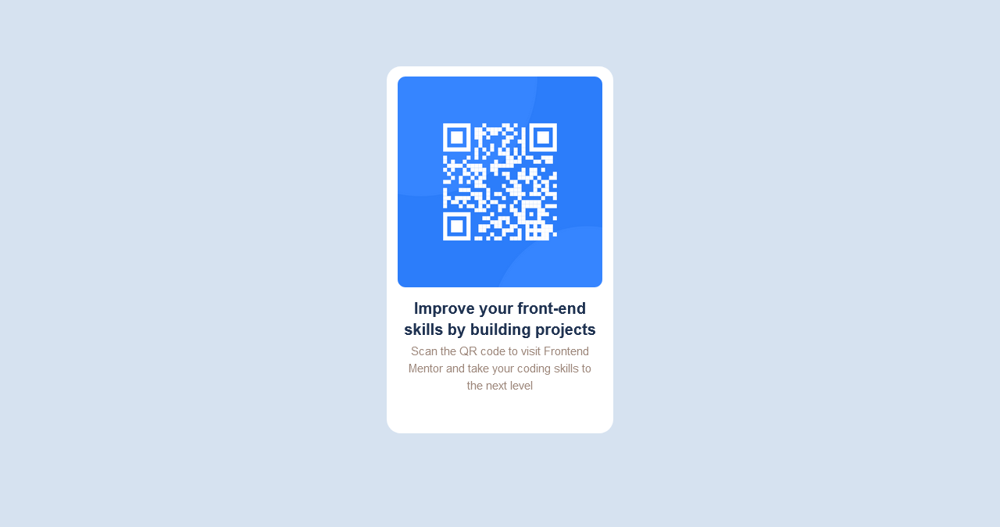

# Frontend Mentor - QR code component solution

This is a solution to the [QR code component challenge on Frontend Mentor](https://www.frontendmentor.io/challenges/qr-code-component-iux_sIO_H). Frontend Mentor challenges help you improve your coding skills by building realistic projects. 

## Table of contents

- [Overview](#overview)
  - [Screenshot](#screenshot)
  - [Links](#links)
- [My process](#my-process)
  - [Built with](#built-with)
  - [What I learned](#what-i-learned)
  - [Continued development](#continued-development)
- [Author](#author)
- [Acknowledgments](#acknowledgments)

## Overview

### Screenshot



### Links

- Solution URL: (https://www.frontendmentor.io/solutions/qrcode-using-html-and-css-HEyz97IaoO)
- Live Site URL: (https://guileless-torte-ef6811.netlify.app/)

## My process

### Built with

- Semantic HTML5 markup
- CSS custom properties
- Flexbox

### What I learned

I like to be honest. I began learning web development earlier this month and to be frank, I didn't find the challenge easy. I had to copy some codes from Khali completed challenge (2-3 lines). Although I copied the code, i'm glad i was able to learn from it.
Here are some codes I'm proud to have learnt
```css
display: flex;
justify-content: center;
}
```
### Continued development

Forms has been one of my major problems since starting out.
I have quite a few times where I'd get frustrated. I'm hoping to get to understand it to the level i want to. Of course, with more practice.

## Author

- Mela Ignatius
- Frontend Mentor - [Mela643](https://www.frontendmentor.io/profile/mela643)
- Twitter - [@Officialmela_](https://www.twitter.com/Officialmela_)

## Acknowledgments
Shout out to https://www.frontendmentor.io/profile/khalil224
for his immense contribution to help out.
Thank you. I really appreciate.
Congratulations to me too. For taking up this challenge to improve my coding skills.
Shout out all the creators of frontend mentor,we really wanna appreciate for bringing up such beautiful ideas to help the upcoming web developers elevate their coding skills.
